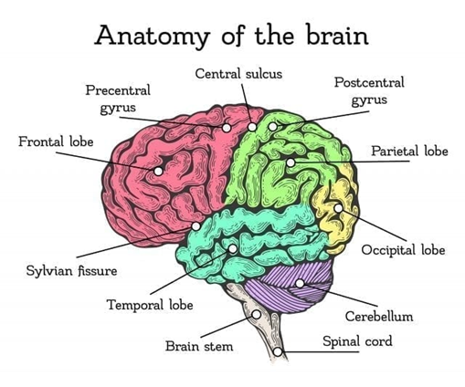

# Computational Neuroscience Notes

A personal knowledge base covering both biological neuroscience and computational neuroscience — to build a unified understanding of the brain comprising of notes, summaries, and study materials.

## About
This repository contains my notes compiled while studying neuroscience concepts. The material spans foundational neurobiology, sensory systems, motor control, learning and memory, and higher cognitive functions.
* There may be some Machine Learning comparisons for concepts *

## Acknowledgments & Credits

These notes draw heavily from the following MIT OpenCourseWare offerings:

- **MIT 9.01 — Introduction to Neuroscience**
  Foundational course covering the structure and function of the nervous system, from molecular and cellular mechanisms to systems-level neuroscience and behavior.
  [MIT OCW 9.01](https://ocw.mit.edu/courses/9-01-introduction-to-neuroscience-fall-2007/)

- **MIT 9.13 — The Human Brain**
  Explores the cognitive neuroscience of the human brain, including perception, attention, memory, language, and social cognition, with emphasis on neuroimaging methods and key findings.
  [MIT OCW 9.13](https://ocw.mit.edu/courses/9-13-the-human-brain-spring-2019/)

- **Fundamentals of Cognitive Neuroscience**  
  Authors: Nicole M. Gage and Bernard J. Baars
  [ScienceDirect](https://www.sciencedirect.com/book/monograph/9780128038130/fundamentals-of-cognitive-neuroscience#book-description)

- *The Computational Brain* by Patricia Smith Churchland & Terrence J. Sejnowski 

- *From Computer to Brain: Foundations of Computational Neuroscience* by William W. Lytton

All course materials referenced are provided by [MIT OpenCourseWare](https://ocw.mit.edu/) under a [Creative Commons License](https://creativecommons.org/licenses/by-nc-sa/4.0/). These notes are independently authored and not affiliated with or endorsed by MIT.

## Disclaimer

These are personal study notes and may contain errors or incomplete information. They are not a substitute for the original course materials, lectures, or textbooks. Always refer to primary sources for accuracy.

## License

This repository is shared for educational purposes. Original MIT OCW content is licensed under [CC BY-NC-SA 4.0](https://creativecommons.org/licenses/by-nc-sa/4.0/).

---

*Made with curiosity and caffeine.*
